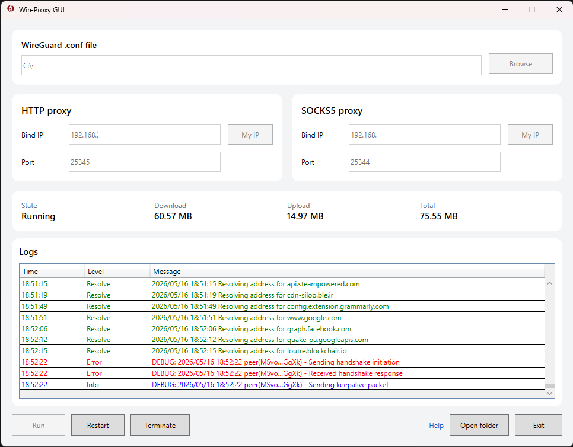

# WireProxy GUI

یک برنامه دسکتاپ ساده برای ویندوز جهت اجرای فایل تنظیمات WireGuard از طریق پروکسی HTTP و SOCKS5 با استفاده از `wireproxy`.

WireProxy GUI برای کاربرانی ساخته شده که می‌خواهند اتصال WireGuard را فقط برای بعضی برنامه‌ها یا مرورگرها استفاده کنند، بدون اینکه کل سیستم ویندوز از VPN عبور کند.

## قابلیت‌ها

- رابط گرافیکی برای ویندوز
- انتخاب فایل WireGuard با پسوند `.conf`
- پشتیبانی از پروکسی HTTP
- پشتیبانی از پروکسی SOCKS5
- تشخیص IP محلی با دکمه‌های **My IP**
- دکمه‌های Run ،Restart و Terminate
- نمایش لاگ زنده داخل برنامه
- نمایش میزان Download ،Upload و Total
- نسخه قابل حمل، بدون نیاز به نصب
- بدون نیاز به ترمینال یا PowerShell برای کاربران عادی

## تصویر برنامه

تصویر برنامه را اینجا اضافه کنید:

```md

```

## پیش‌نیازها

- Windows 10 یا Windows 11
- فایل معتبر WireGuard با پسوند `.conf`
- فایل `wireproxy.exe` که داخل بسته انتشار قرار می‌گیرد

## دانلود

آخرین نسخه ZIP را از بخش **Releases** دانلود کنید.

ساختار پیشنهادی بسته:

```text
WireProxyGui-win-x64.zip
├─ WireProxyGui.exe
├─ wireproxy.exe
└─ README.txt
```

## روش استفاده

1. فایل ZIP نسخه منتشر شده را دانلود کنید.
2. فایل ZIP را از حالت فشرده خارج کنید.
3. فایل `WireProxyGui.exe` را اجرا کنید.
4. فایل WireGuard با پسوند `.conf` را انتخاب کنید.
5. در صورت نیاز، IP و Port مربوط به HTTP و SOCKS5 را تنظیم کنید.
6. روی **Run** کلیک کنید.
7. مرورگر یا برنامه موردنظر را تنظیم کنید تا از پروکسی استفاده کند.

نمونه پورت‌های پیش‌فرض:

```text
HTTP   127.0.0.1:25345
SOCKS5 127.0.0.1:25344
```

## استفاده از پروکسی در برنامه‌ها

می‌توانید از پروکسی محلی ساخته شده در برنامه‌هایی استفاده کنید که از HTTP یا SOCKS5 پشتیبانی می‌کنند.

نمونه‌ها:

- تنظیمات پروکسی مرورگر
- تنظیمات پروکسی Firefox
- تنظیمات پروکسی Telegram
- ابزارهای مدیریت پروکسی
- برنامه‌هایی که از SOCKS5 یا HTTP proxy پشتیبانی می‌کنند

## اشتراک‌گذاری پروکسی در شبکه محلی

اگر می‌خواهید دستگاه دیگری در شبکه محلی از این پروکسی استفاده کند، به جای `127.0.0.1` از IP محلی کامپیوتر خود استفاده کنید.

مثال:

```text
192.168.1.10:25345
```

سپس روی دستگاه دیگر، همین IP و Port را به عنوان پروکسی وارد کنید.

مطمئن شوید فایروال ویندوز اجازه استفاده از پورت انتخاب شده را می‌دهد.

## لاگ‌ها و میزان مصرف

برنامه لاگ‌های زنده و میزان مصرف ترافیک را نمایش می‌دهد.

رنگ لاگ‌ها:

- سبز: لاگ‌های مربوط به resolve یا DNS
- قرمز: خطا، timeout یا مشکل handshake
- آبی: اطلاعات عادی برنامه

میزان مصرف:

- Download
- Upload
- Total

این اعداد مربوط به ترافیکی هستند که از اتصال فعال `wireproxy` عبور می‌کند، نه کل مصرف اینترنت ویندوز.

## نکات مهم

- این برنامه یک VPN کامل برای کل سیستم نیست.
- فقط برنامه‌هایی که برای استفاده از HTTP یا SOCKS5 تنظیم شوند از این اتصال استفاده می‌کنند.
- در نسخه فعلی، فایل `wireproxy.exe` لازم است.
- فایل‌های `WireProxyGui.exe` و `wireproxy.exe` باید کنار هم باشند.
- فایل WireGuard شما فقط به صورت محلی انتخاب می‌شود و توسط این برنامه جایی آپلود نمی‌شود.

## ساختار پروژه

```text
WireProxyGui/
├─ src/
│  └─ WireProxyGui/
│     ├─ Models/
│     ├─ Services/
│     ├─ Assets/
│     ├─ App.xaml
│     ├─ App.xaml.cs
│     ├─ MainWindow.xaml
│     ├─ MainWindow.xaml.cs
│     ├─ WireProxyGui.csproj
│     └─ wireproxy.exe
├─ docs/
│  └─ screenshot.png
├─ README.md
└─ README.fa.md
```

## ساخت از سورس

پیش‌نیازها:

- ویندوز
- .NET 8 SDK

دستور build و publish:

```powershell
dotnet publish .\src\WireProxyGui\WireProxyGui.csproj -c Release
```

فایل‌های خروجی در این مسیر ساخته می‌شوند:

```text
src\WireProxyGui\bin\Release\
```

## ارجاع‌ها

- wireproxy: https://github.com/windtf/wireproxy
- ساخته شده با WPF و .NET 8

## لایسنس

این پروژه متن باز است. برای جزئیات، لایسنس موجود در ریپو را بررسی کنید.
